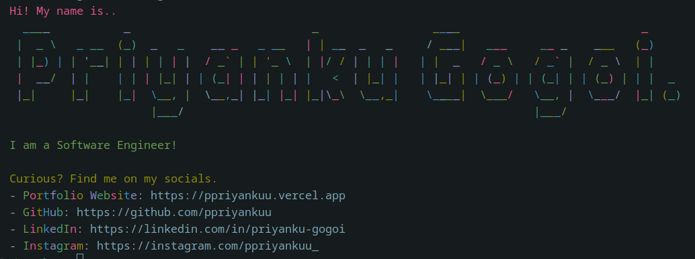

# echoMe
A simple CLI tool to introduce myself with colorful output, ASCII art, and my social media links.

### Features
- Displays your name in big ASCII art.
- Describes you as a software engineer.
- Lists your social media profiles (Portfolio, GitHub, LinkedIn, Instagram) in a colorful format.

### Snapshot
